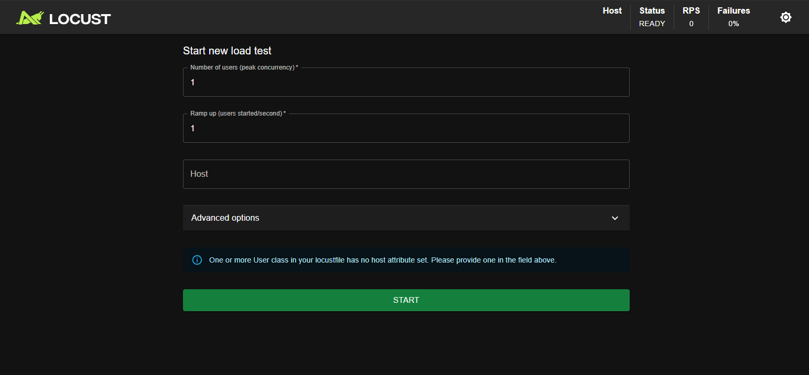

# LOCUST + GATEWAY API [GKE] + API REST(RUST)

> **Nota:**
> `Para este ejemplo se considera que se tiene levantado el ejemplo de Container Zot`


El siguiente readme presenta un ejemplo para la configuración de un cluster de k8s en Google Cloud con el despliegue de una API REST en Rust para el consumo de solicitudes originadas desde LOCUST.

---

## API REST(RUST)
Para este ejemplo se considerará que se tiene cierto conocimiento básico de Rust. Las estrcutura general de este ejemplo básico es:

```
api/
├── Cargo.toml
├── Dockerfile
└── src/
    └── main.rs
```

- `Cargo.toml`: Dependencias del archivo de RUST
- `Dockerfile`: Instrucciones para crear la imagen de la API REST de RUST.
- `main.rs`: Código fuente de la API REST de RUST.

La API REST que se encuentra en `main.rs` es un ejemplo super básico y lo único que contiene es un endpoint que recibe mensajes/tweets con 3 campos:
- *Pais de origen del mensaje*
- *Nombre de usuario de quien envia el mensaje*
- *El cuerpo del mensaje*

Dentro del archivo de rust se encuentran comentados las líneas para indicarle al servidor donde escuchar, dependiendo del tipo de pruebas a realizar (locales o en k8s) deberán descomentar unas u otras (En el códgo se indican explicitamente cuales son esas líneas)

### Local
En caso de probar localmente será necesario descomentar las líneas correspondientes y ejecutar:
```bash
cargo run
```

Se debería ver:
```bash
Servidor en http://127.0.0.1:8080
```

Y se pueden realizar pruebas con `curl`,`POSTMAN` o cualquier otro tipo de herramientas similaers. JSON de ejemplo:

```json
{
    "pais":"GTM",
    "usuario":"User_4821",
    "mensaje":"Hola desde Guatemala 🇬🇹"
}
```

### Kubernetes (k8s)
Para este curso se utiliza Zot en una VM en la nube para el manejo de las imagenes de nuestra aplicación, recordemos que para subir imagenes a ZOT usamos:
```bash
# Construir y subir la imagen a ZOT
docker build -t <IP_VM_DOCKER>:5000/api:v1 .
docker push <IP_VM_DOCKER>:5000/api:v1

# Para verificar ZOT
curl http://<IP_VM_DOCKER>:5000/v2/_catalog
```

### Configuración de Zot

Para poder desplegar nuestra aplicación en k8s vamos a necesitar configurar nuestra máquina virtual para que el **apply** funcione correctamente. Para esto existen las siguientes opciones:

#### Implementación de ngrok o similares

> **Nota**: Esta forma de realizar un "puente" entre nuesta máquina con ZOT y nuestro clúster de k8s no es recomendada para proyectos formales dada la naturaleza de la versión gratuita de ngrok. Idealmente este método debe implementarse solo en desarrollo o proyectos personales/pequeños.

Con ngrok es posible implementar un "tunel" temporal entre un entorno local e internet público. Es más rápido, pero la dirección de ngrok cambia con cada reinicio.

```bash
# 1. Instalar ngrok en la VM
curl -sSL https://ngrok-agent.s3.amazonaws.com/ngrok.asc | sudo tee /etc/apt/trusted.gpg.d/ngrok.asc >/dev/null
echo "deb https://ngrok-agent.s3.amazonaws.com buster main" | sudo tee /etc/apt/sources.list.d/ngrok.list
sudo apt update && sudo apt install ngrok

# 2. Autenticarse (necesitamos una cuenta en ngrok.com)
ngrok config add-authtoken TU_TOKEN

# 3. Exponer el puerto 5000 de Zot
ngrok http 5000
```

Para obtener la url de ngrok:

```
https://abc123.ngrok-free.app  ->  http://localhost:5000
```

---

Con ZOT configurado procedemos a hacer un apply de nuestros archivos de k8s, siempre teniendo en cuenta que es necesario modificar el deployment con la dirección de nuestro server de ZOT:

```bash
# Aplicar los manifiestos
kubectl apply -f deployment.yaml
kubectl apply -f service.yaml
```

Con la aplicación desplegada en nuestro clúster ya podemos configurar nuestro GATEWAY API.

## GATEWAY API
Para configurar el Gateway API primero tendremos que activar el GATEWAY API (Configuración de puertas de enlace) en la sección de Redes o Networking en la configuración del Cluster de k8s en Google.

Una vez que tengamos la API de RUST desplegada ejecutamos tendremos que hacer un apply de los manifestos relacionados al GATEWAY:

```bash
kubectl apply -f gateway.yml
kubectl apply -f healthcheckpolicy.yml
kubectl apply -f httproute.yml
```

Con los archivos ejecutados podemos obtener la IP externa del GATEWAY con:
```bash
kubectl get gateway rust-api-gateway -w
```

Para verificar el flujo de todo podemos usar los siguientes comandos:

```bash
# Ver IP del Gateway
kubectl get gateway rust-api-gateway

# Ver que la ruta esté aceptada
kubectl describe httproute rust-api-route

# Probar el endpoint
curl http://<EXTERNAL_IP>/messages
```

---

## LOCUST
Locust es un framework de código abierto para realizar pruebas de carga o *load testing* que permite simular un flujo de usuarios concurrentes a través de scripts de Python. Para poder ejecutar Locust es necesario instalar la herramienta con:
```bash
pip install locust
```
En windows a veces sucede que es necesario configurar las variables de entorno para que el comando *locust* funcione, para este caso ejecutamos lo siguiente en una terminal:
```bash
pip show locust
```

Copiamos la dirección de **Location**, la cuál debería ser similar a:
```
C:\Users\<Usuario>\AppData\Local\Programs\Python\Python3x\Lib\site-packages
```
Pero reemplazamos `Lib\site-packages` con Scripts:
```
C:\Users\<YourUsername>\AppData\Local\Programs\Python\Python3x\Scripts
```
Luego:
- Abrimos las variables de entorno de windows.
- Seleccionamos *Path* de las variables del sistema.
- Damos click en editar.
- Click nuevo y pegamos el path de Scripts anteriormente mencionado.
- Guardamos los cambiso.

Con locust instalado configuramos nuestro archivo de python. La estructura general de estos archivos son:
```python
from locust import HttpUser, task, between
class UsuarioBasico(HttpUser):

    wait_time = between(1, 3)

    @task(3) 

    def ver_home(self):
        self.client.get("/")

    @task(1)
    def ver_about(self):
        self.client.get("/messages")
```
---
`from locust import HttpUser, task, between`:La primera línea corresponde a la importación de las clases/funciones de locust.

A continuación se explica que hace cada una de los imports
- `HttpUser`: Permite representar un "usuario" con un cliente de HTTP.
- `task`: Decorador para indicar que métodos serán "tareas"(como hacer clic en un botón, iniciar sesión o cargar una página) que el usuario ejecutará.
- `between`: Función que definirá los tiempos de espera entre "tareas".

`class UsuarioBasico(HttpUser)`: Corresponde a una clase que funcionará como un usuario.

`wait_time = between(1, 3)`:Después de ejecutar cada tarea, el "usuario" espera un tiempo(aleatorio) para realizar la siguiente tareas.

`@task(3)` y `@task(1)`: Definen las tareas, el número en paréntesis indica el "peso" o probabilidad de que la tarea se ejecute luego del tiempo de espera. Por ejemplo:

- 3 →  75% de las veces sucede
- 1  →  25% de las veces sucede

Las tareas por defecto tienen el valor es 1.

`def ver_home(self)` / `def ver_about(self)`: Son métodos de Python, con el decorador anterior (task) se convierten en tareas de locust, cada una tiene acciones diferentes.

`self.client.get("/")`/`self.client.get("/about")`: Es la sesión HTTP del usuario, estas tareas en específico son GETS y cada una representa un endpoint a testear. En la interfaz de locust nosotros agregaruemos una dirección, que se complementará con estos endpoints. Es decir, que para el caso del **get de about**, al ejecutar locust se estaría llamando a la dirección:

```
<direccion-desde-la-interfaz-de-locust>/about
```

Con el archivo creado, ejecutamos

```
locust -f <nombre_archivo_locust>.py
```

Esto abrirá una terminal similar a:


A continuación se explica la función de cada campo:
- `Number of users (peak currency)`: Número de "usuarios" máximos concurrentes que ejecutarán las tareas.
- `Ramp up (users started/second)`: Se considera como la "aceleración", indica cuantos usuarios se iran generando por segundo hasta alcanzar el valor máxmio definido en el campo anterior.
- `Host`: Dirección base a donde se enviaran las solicitudes (se complementa con los endpoints definidos en el archivo de Python)

En la sección de opciones avanzadas encontraremos:
- `Run Time`: Se define un máximo de tiempo para ejecutar la simulación de carga.
- `Profile`: Permite asignar un nombre a cada prueba para poder reutilizar configuraciones preestablecidas.

Para este ejemplo colocaremos un *Number of users* de 100 y un *Ramp up* de 2 y para el host utilizaremos la ip externa generada por el GATEWAY API.